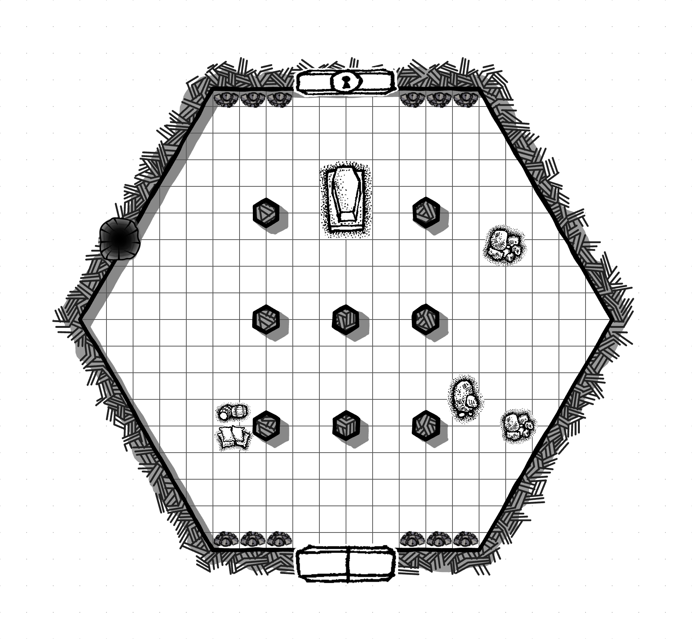

[назад](/index.md)
# Ворота в гробницу

## Цель
* Понять как открыть гробницу 
* Получить задание от бандитов
* Узнать, что гробница проклята

## Важные персонажи
* Коен
  * Вожак
  * Алчен
  * Не верит в предостережения Рамена
* Рамен
  * Историк
  * Знаток гробниц

## Банда Коена
* Банда Коена состоит из 10 бандитов и самого Коена
* Они пришли в гробницу так как узнали, что в ней лежит дварфийский артефакт
* Они хотят открыть гробницу
* У нах в плену Рамен, который знает как открыть гробницу

## Рамен
* Рамен все время повторяет "Мы все прокляты".
* Может рассказать, что похищенный ключ разозлил охрану.
* Охрана набирает силу и скоро будет что-то делать
* Что бы успокоить стражников надо пролить кровь в гробнице
* Для этого нужно ее открыть - нужен ключ

## Детали локации
* Ключ должен быть где-то в подземельях
* Гробница уже потревожена и надо принести и оставить жертву внутри, что бы успокоить потусторонние силы. 
* Коен понял, что ключ нашли и забрали гоблины, которые обитают у выхода 
* Ключ был в разоренной саркофаге

